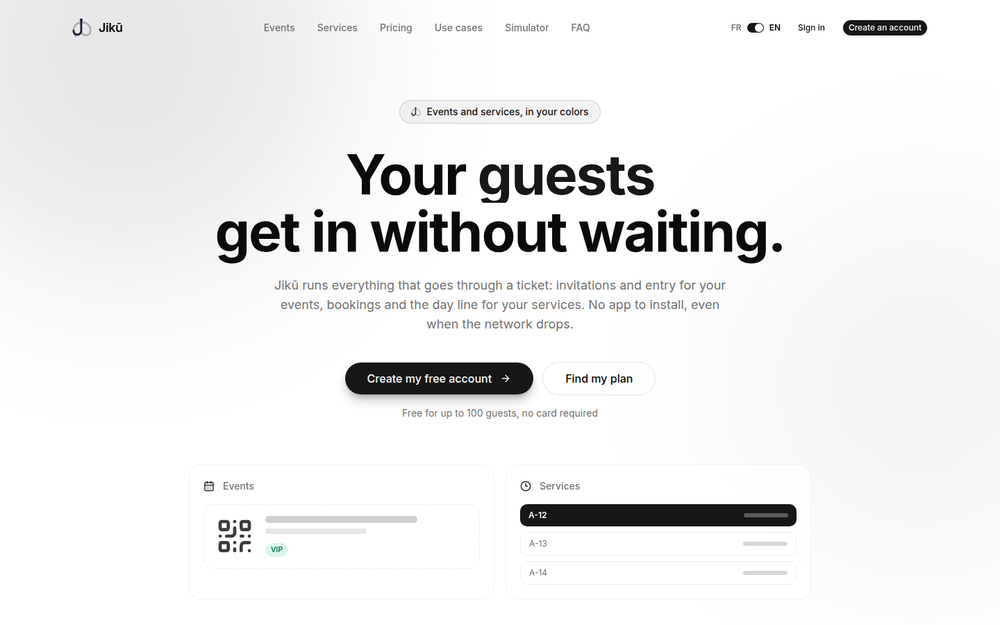
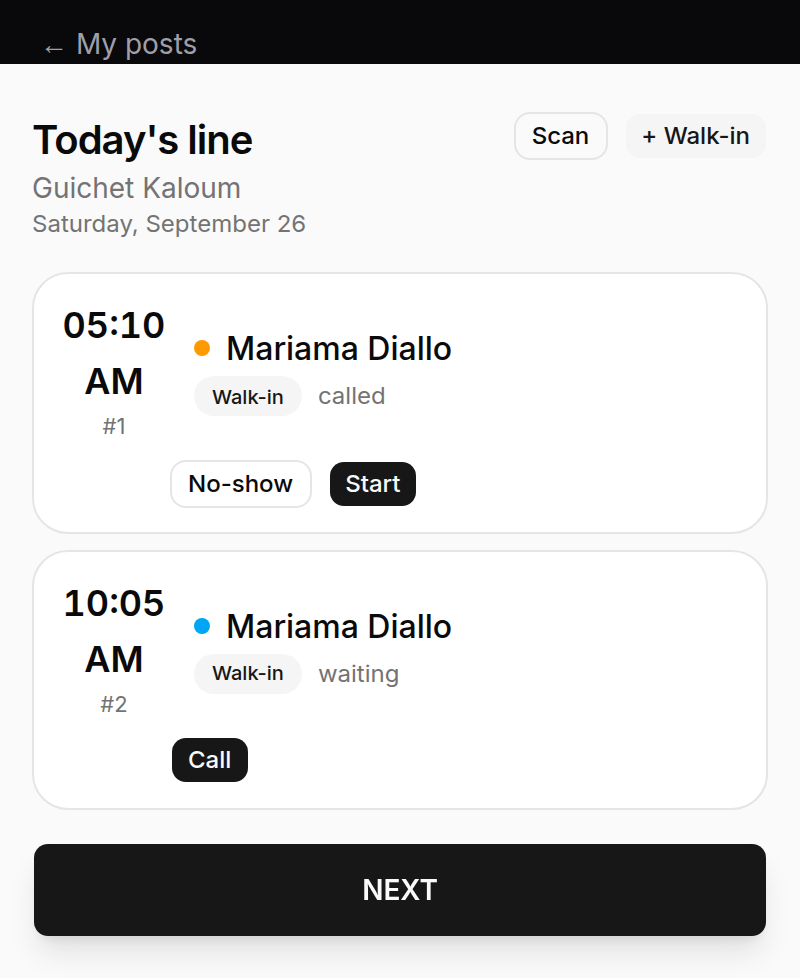

<div align="center">


# Jikū

**Invitations, tickets, appointments and queues for organizations in francophone Africa.**

The web app of Jikū: Next.js 16, React 19, TypeScript and Tailwind CSS, in French and English.

[API](https://github.com/youmssi/jiku_app) ·
[Architecture](#architecture) ·
[Getting started](#getting-started) ·
[Contributing](CONTRIBUTING.md)




</div>

---

## About

Jikū replaces the WhatsApp groups, spreadsheets and printed cards organizations
use to receive people. Wedding planners, hotels, clinics, banks and
administrations use it for two jobs:

- **Events.** Invite guests by WhatsApp, e-mail or SMS, collect RSVPs, send QR
  tickets and check people in at the door, even when the network drops.
- **Services.** Clients book an appointment or take a ticket for today's line
  from a QR code at the entrance, follow their place on their phone, and are
  called in order at the counter.

No app to install: guests, clients and staff use the web on any phone.

<table>
<tr>
<td width="50%" valign="top">

**For organizers**

- A "Today" home with what needs attention
- Events with ticket categories, prices and payment rules, publish checklist, live dashboard and analytics
- Guest lists by CSV import, three delivery modes, reminders
- Services, resources, weekly schedules, booking links, short codes and an embeddable widget
- Operators with a scope and a personal link
- Branding, members and roles, legal identity for invoices
- Billing in GNF, FCFA or USD: plans, the Organizer Pack, event tiers, online payment with Mobile Money or card, invoices

</td>
<td width="50%" valign="top">

**For guests, clients and staff**

- Invitation page with RSVP, ticket transfer and calendar link
- Ticket page with QR code and what is left to pay
- Appointment booking and self-service cancellation
- A ticket for today's line from the entrance QR, with the live rank
- Door console with offline scanning, duplicate detection and payment collection
- Counter console: one line for appointments and walk-ins, "next" in one tap



</td>
</tr>
</table>

A platform desk for the Jikū team covers tenants, payments, trials, agreements,
prices, WhatsApp health, feedback and the audit log.

## Architecture

The app is a backend-for-frontend: the browser never calls the API directly for
signed-in pages. Server Components and Server Actions call the
[Jikū API](https://github.com/youmssi/jiku_app) with the session held in
httpOnly cookies.

### Routes

Routes are grouped by who uses them. Groups do not change the URL.

```
app/
├── [locale]/                 "/" is French (default), "/en/..." is English
│   ├── (organizer)/
│   │   ├── (auth)/           /login, /register, /forgot-password, /reset-password, /verify-email
│   │   └── (app)/            /dashboard, /events, /services, /operators, /billing, /settings
│   ├── (guest)/              /invitation/[token], /o/[username]
│   ├── (operator)/           /checkin/[token], /line/[token], /operator/[code]
│   ├── (admin)/              /admin/...
│   ├── r/[code]              booking link, today's line, a client's ticket
│   ├── widget/[token]        embeddable booking widget
│   └── page.tsx              landing page, simulator, use cases, FAQ, legal pages
└── api/                      route handlers for file downloads (receipts, exports, certificates)
```

### Modules

Code is split by business domain, not by role. Each module in
`components/modules/<domain>/` is a flat folder with the same layers, and
dependencies point one way:

```
routing (app/)  →  component  →  cache hook  →  service  →  contract
```

| File | Layer | Responsibility |
|---|---|---|
| `schema.ts` | Contract | Zod schemas and types; API shapes are aliases of the generated OpenAPI types |
| `<domain>.service.ts` | Service | Server Actions returning `ActionResult<T>`; the only place HTTP statuses become messages |
| `<domain>.queries.ts` | Service | Server-only reads for Server Components |
| `use<Domain>.ts` | Cache | Client polling hooks, paused while the tab is hidden |
| `<feature>.tsx` | Component | UI and validation (react-hook-form with Zod); never calls `fetch` |
| `index.ts`, `server.ts` | Barrels | The module's public surface; server-only loaders stay out of client bundles |

Other modules import a module only through its barrel. Shared code lives in
`components/shared/`, and shadcn/ui primitives in `components/ui/`.

### Conventions

- **Server Components first.** `"use client"` only for interactivity, browser
  APIs or client state.
- **Every string is translated.** Catalogs live in `messages/<locale>/<namespace>.json`;
  French is the reference that types every key, and `pnpm i18n:check` fails CI
  when English drifts. Zod messages are `common.validation` keys.
- **Locale-aware navigation.** `Link`, `useRouter` and `redirect` come from
  `@/i18n/navigation` so the active locale survives navigation.
- **Typed API contract.** `lib/api-types.ts` is generated from the API's
  OpenAPI document; a backend change becomes a type error, not a runtime surprise.
- **Thin pages.** A `page.tsx` reads params and renders one module component.
- **No hardcoded configuration.** Every URL, key and threshold is an
  environment variable, documented in `.env.example`.

## Tech stack

| | |
|---|---|
| Framework | Next.js 16 (App Router, Server Actions), React 19 |
| Language | TypeScript, strict |
| UI | Tailwind CSS 4, shadcn/ui, Radix, Lucide |
| Forms | react-hook-form, Zod |
| i18n | next-intl, French and English |
| Data | Server-side `fetch` to the API with typed contracts from openapi-typescript |
| Offline | Service worker and IndexedDB for the door console |
| Observability | Sentry, Umami (cookie-free analytics) |

## Getting started

### Prerequisites

- Node.js 20 or later
- pnpm
- The [Jikū API](https://github.com/youmssi/jiku_app) running locally (`./gradlew bootRun`)

### Run locally

```bash
pnpm install
cp .env.example .env.local   # optional: defaults point at http://localhost:8080
pnpm dev                     # http://localhost:3000
```

### Scripts

| Command | What it does |
|---|---|
| `pnpm dev` | Development server |
| `pnpm build` | Production build (type checks included) |
| `pnpm start` | Serve the production build |
| `pnpm lint` | ESLint |
| `pnpm i18n:check` | Checks the English catalogs match the French reference |

### Regenerate API types

After a backend contract change:

```bash
cp ../jiku_app/openapi/openapi.json openapi/openapi.json
npx openapi-typescript openapi/openapi.json -o lib/api-types.ts
```

Commit both files together. See [`openapi/README.md`](openapi/README.md).

## Configuration

[`.env.example`](.env.example) lists every variable in two sections:

- **Required in production:** the public site URL, the API URL for the browser
  and the server, and the support e-mail.
- **Optional, per feature:** Google sign-in, online payment
  (`ONLINE_PAYMENT_ENABLED`), support WhatsApp and sales e-mail, error tracking
  (Sentry), analytics (Umami), Google Search Console.

`NEXT_PUBLIC_*` values are inlined at build time and public; everything else is
server-only.

## Deployment

The app deploys to Vercel. Every pull request gets a preview deployment;
`develop` is the integration branch and merging `develop` into `main` releases
to production. The embeddable booking widget is documented in
[`docs/widget-integration.md`](docs/widget-integration.md).

## Contributing

[`CONTRIBUTING.md`](CONTRIBUTING.md) describes the workflow: one branch per
story (`jiku-{n}-{slug}`) from an up-to-date `develop`, Conventional Commits with
a `Refs: JIKU-<n>` trailer, and a squash merge once lint and build are green.
[`AGENTS.md`](AGENTS.md) holds the engineering rules.

## License

This repository is private. All rights reserved.
